# kellaspace

A mobile-first site for my best friend and I to stay connected.

## Current build

[Link to vercel deployment](https://kellaspace-frontend.vercel.app/) - ⚠️ The site is usable on all devices but most **optimised for smaller screens**. I will be implementing proper desktop designs once the mobile site is fully functional.

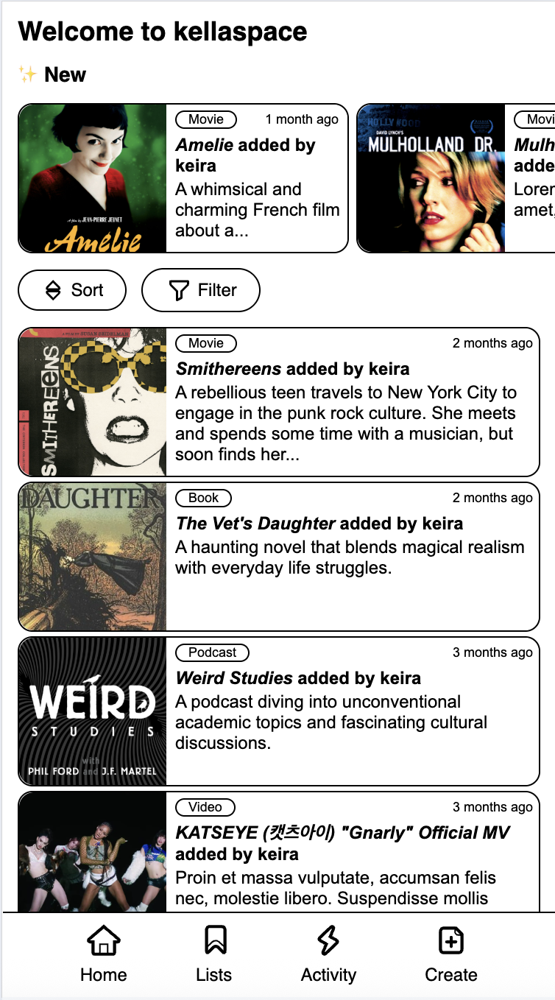
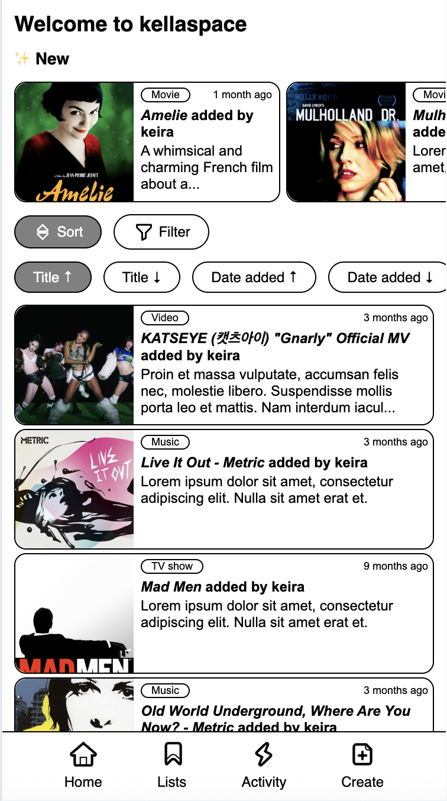
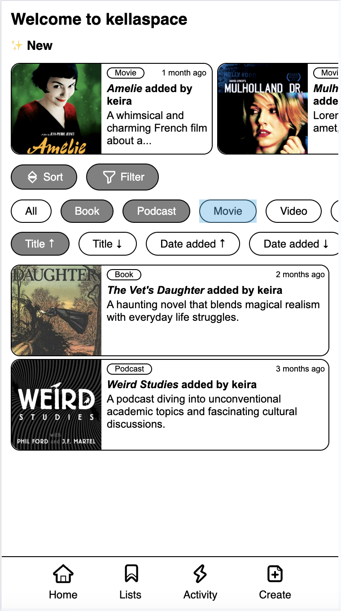
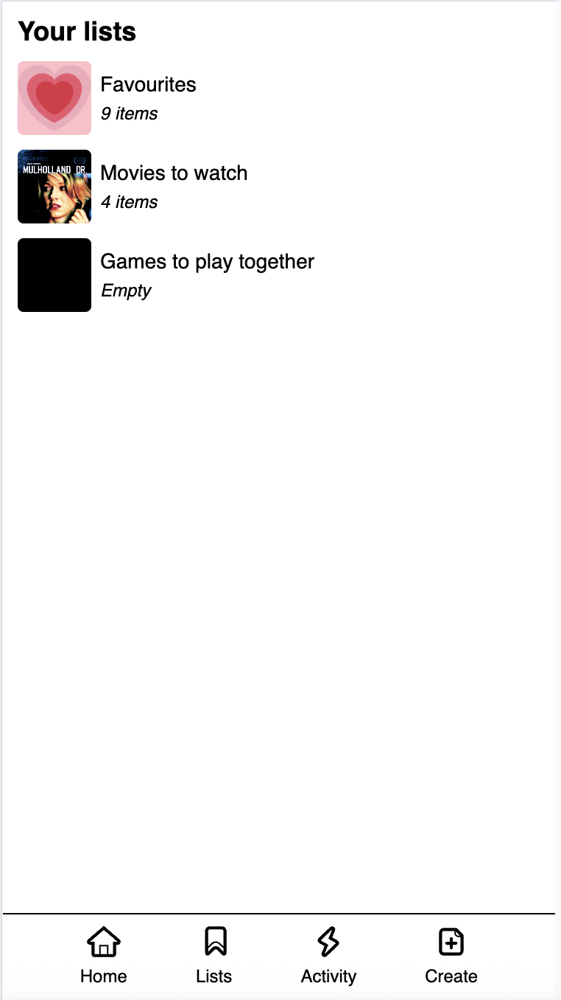
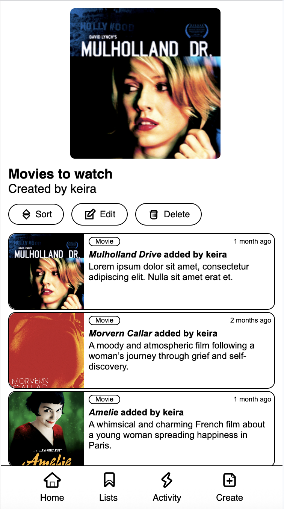
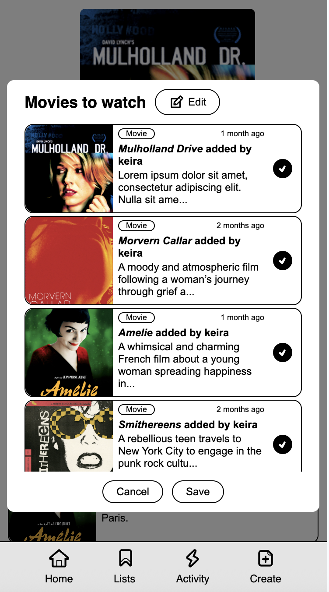
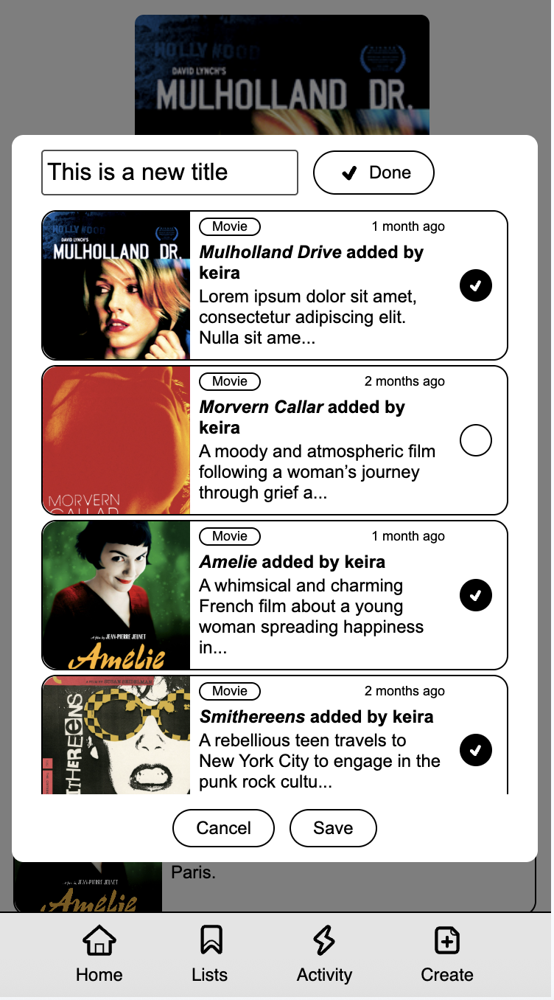
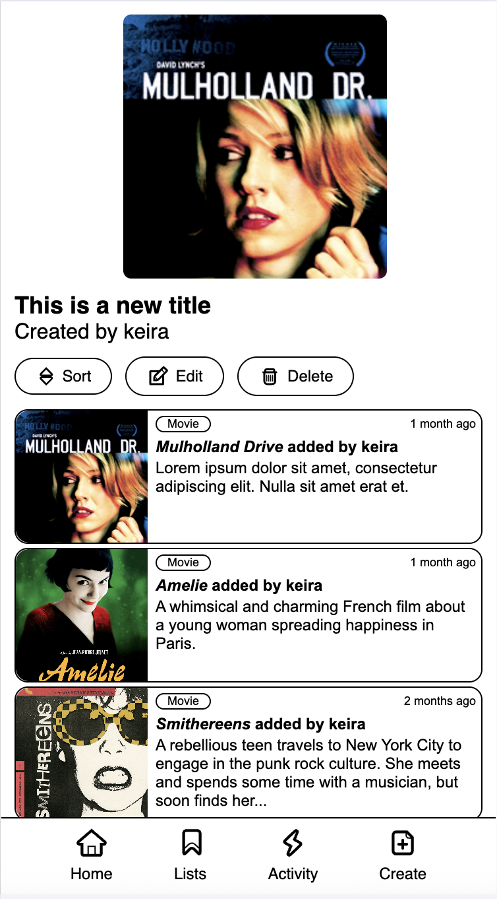
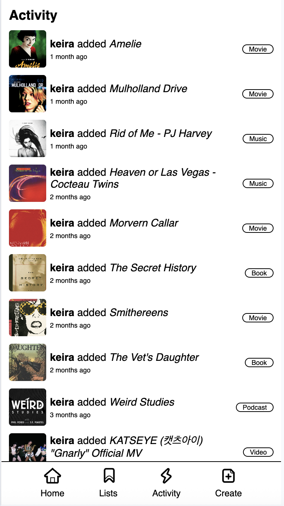
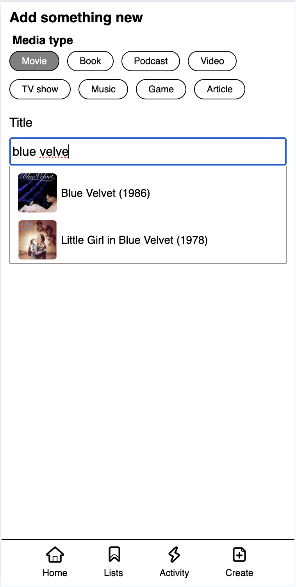
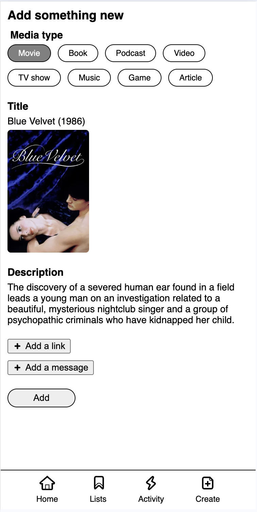

## Main features

- View recommendations sorted by date ✅
- Filter recommendations by media type ✅
- Add new recommendations
- Add tags for extra sorting functionality
- Search recommendations by tags and keywords
- Backend integration
- Login and authentication

## Stretch goals

- Use APIs to get metadata for added recommendations (e.g. streaming availability, image, genre etc.)
- Manage activities, events and plans
