# kellaspace

A mobile-first site for my best friend and I to stay connected.

## Current build

[Link to vercel deployment](https://kellaspace-frontend.vercel.app/) - ⚠️ The site is usable on all devices but most **optimised for smaller screens**. I will be implementing proper desktop designs once the mobile site is fully functional.

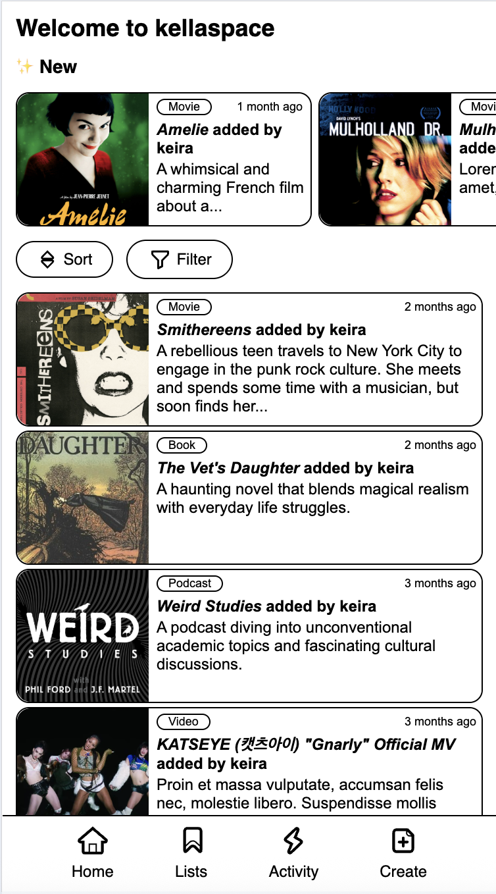
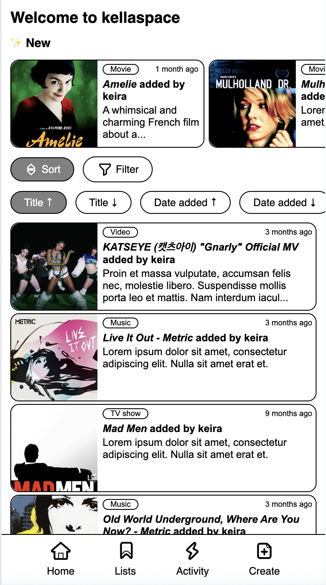
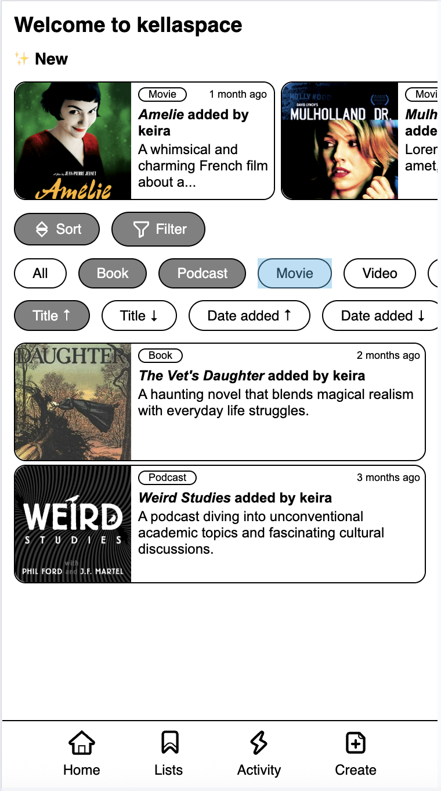
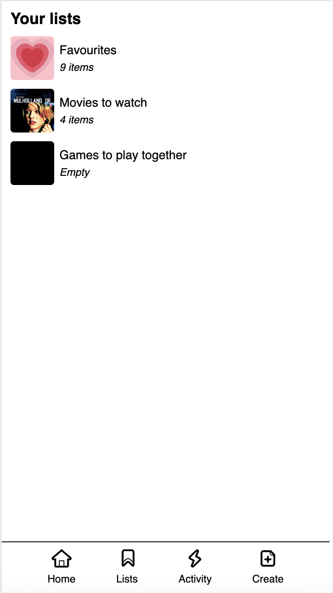
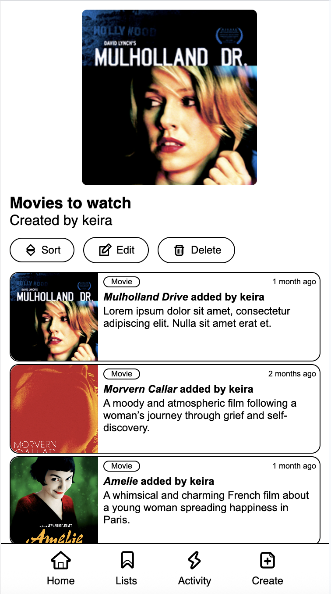
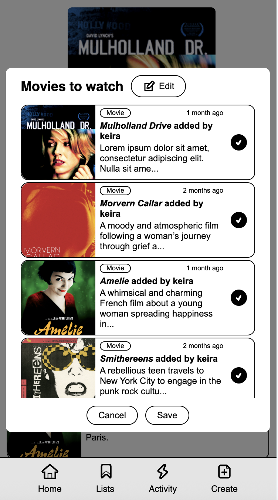
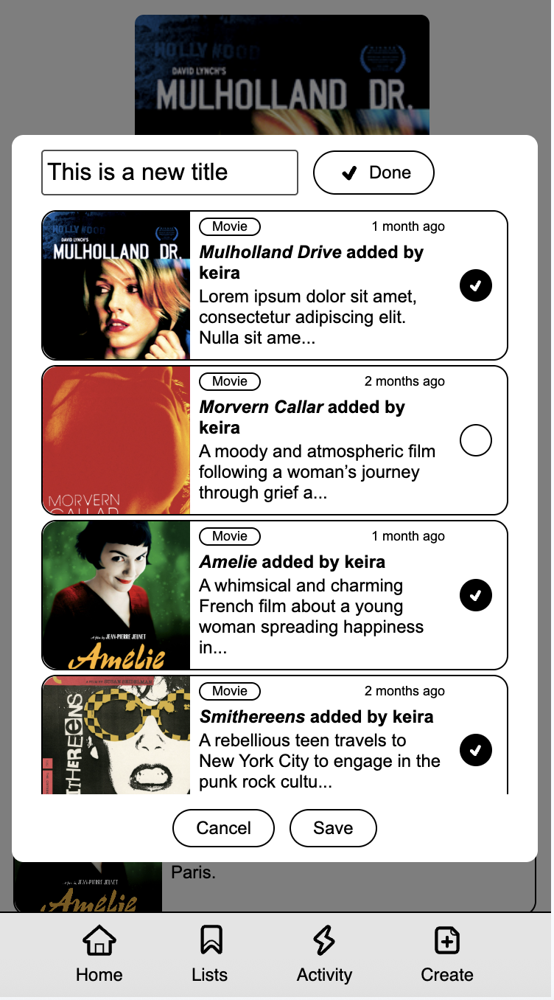
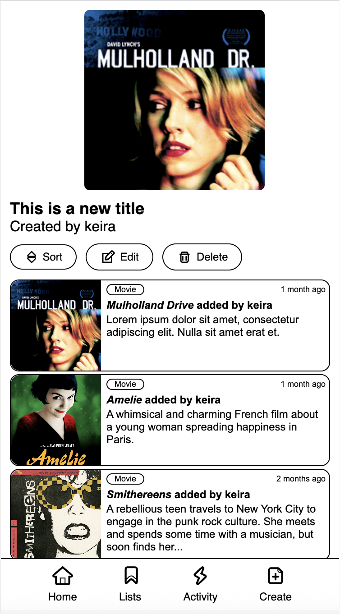
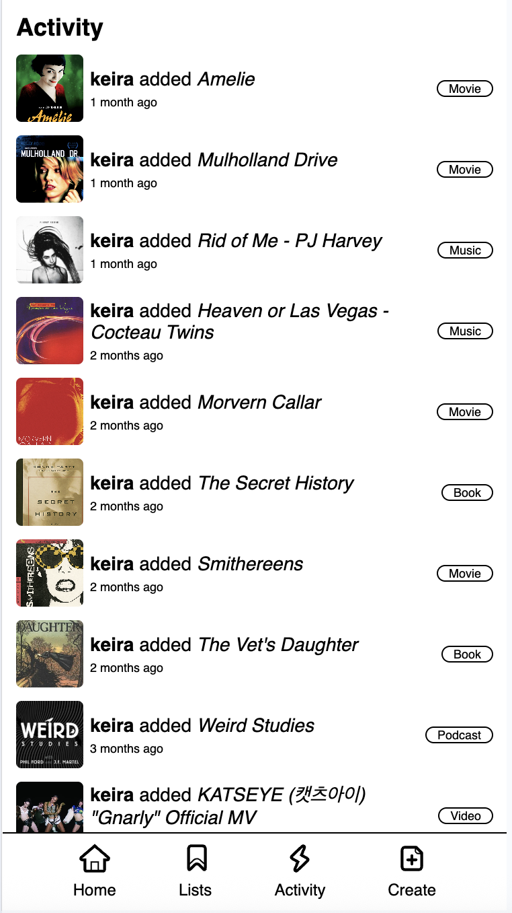
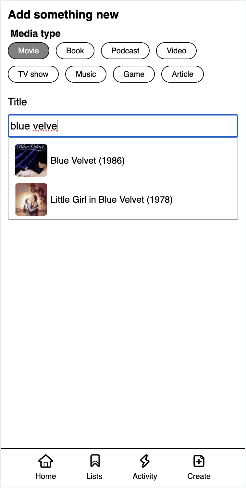
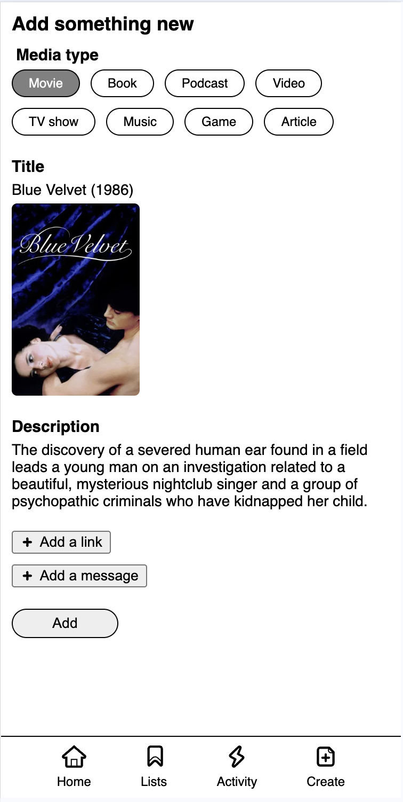

## Tech stack

### Frontend

- TypeScript
- React
- React Router
- Emotion
- Framer Motion
- Swiper
- Auth0

### Backend

- [Link to repo](https://github.com/keirastanley/kellaspace_backend)
- TypeScript
- Node.js
- Express
- MongoDB
- Cors
- Dotenv
- Zod

## Main features

- View recommendations sorted by date ✅
- Filter recommendations by media type ✅
- Add new recommendations ✅
- Uses APIs to get metadata when adding new recommendations ✅
- Add tags for extra sorting functionality
- Search recommendations by tags and keywords
- Backend integration ✅
- Login and authentication ✅

## Stretch goals

- Manage activities, events and plans
